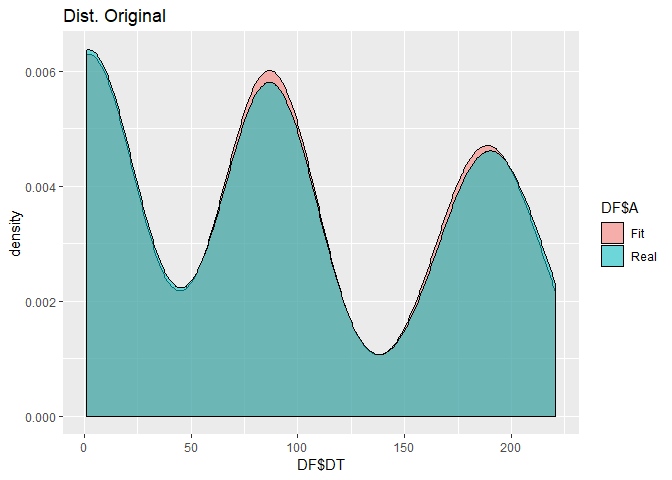
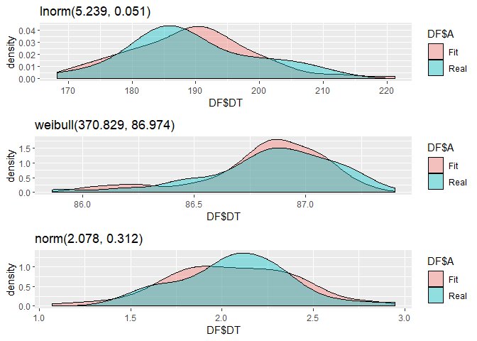

<!-- README.md is generated from README.Rmd. Please edit that file -->

# FitUltD

<!-- badges: start -->

<!-- badges: end -->

The goal of FitUltD is to fit data that can’t be fitted with ordinary
density functions

## Installation

You can install the released version of FitUltD from
[CRAN](https://CRAN.R-project.org) with:

install.packages(“FitUltD”)

## Example

This is a basic example which shows you how to fit a multimodal random
variable:

``` r
library(FitUltD)
#> Loading required package: mclust
#> Package 'mclust' version 5.4.5
#> Type 'citation("mclust")' for citing this R package in publications.
#random Variable
RV<-c(rnorm(73,189,12),rweibull(82,401,87),rgamma(90,40,19))

FIT1<-FDistUlt(RV, plot=TRUE, subplot = TRUE)
#> <simpleError in optim(par = vstart, fn = fnobj, fix.arg = fix.arg, obs = data,     gr = gradient, ddistnam = ddistname, hessian = TRUE, method = meth,     lower = lower, upper = upper, ...): non-finite finite-difference value [2]>
#> <simpleError in optim(par = vstart, fn = fnobj, fix.arg = fix.arg, obs = data,     gr = gradient, pdistnam = pdistname, hessian = TRUE, method = meth,     lower = lower, upper = upper, ...): non-finite finite-difference value [2]>
```

What is special about using `README.Rmd` instead of just `README.md`?
You can include R chunks like so:

``` r
FIT1[[3]]
#>                    Distribucion  Prop_dist    AD_p.v    KS_p.v Chs_p.v
#> AD6         lnorm(5.242, 0.052) 0.29795918 0.8372311 0.8985857       0
#> AD8    weibull(434.484, 86.552) 0.09387755 0.8861584 0.7938189       0
#> AD2  gamma(497882.65, 5721.237) 0.24081633 0.7523182 0.7705192       0
#> AD61        lnorm(0.722, 0.162) 0.36734694 0.9807500 0.9616154       0
```

You’ll still need to render `README.Rmd` regularly, to keep `README.md`
up-to-date.

You can also embed plots, for example:




