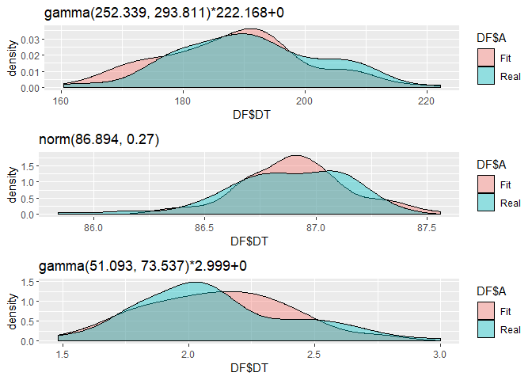

<!-- README.md is generated from README.Rmd. Please edit that file -->
FitUltD
=======

<!-- badges: start -->
<!-- badges: end -->
The goal of FitUltD is to fit data that can't be fitted with ordinary density functions

Installation
------------

You can install the released version of FitUltD from [CRAN](https://CRAN.R-project.org) with:

install.packages("FitUltD")

Example
-------

This is a basic example which shows you how to fit a multimodal random variable choosing your own distributions:

``` r
library(FitUltD)
#> Loading required package: mclust
#> Package 'mclust' version 5.4.5
#> Type 'citation("mclust")' for citing this R package in publications.
#Random Variable
set.seed(3110)

RV <- c(rnorm(73,189,12), rweibull(82,401,87), rgamma(90,40,19))

Nombres <- c("norm","weibull","gamma","exp","cauchy")

FIT1 <- FDistUlt(RV, plot = TRUE, subplot = TRUE)
```

One of the available options is to show the distribution functions that passed the Anderson Darling and Kolmogorov Smirnov tests, as well as their p-value and the proportion of the total distribution.

``` r
FIT1[[3]]
#>                           Distribution Dist_Prop  Dist    AD_p.v    KS_p.v
#> AD7  gamma(252.339, 293.811)*222.168+0 0.2979592 gamma 0.8859093 0.9397635
#> AD2                 norm(86.894, 0.27) 0.3346939  norm 0.5466113 0.7882263
#> AD71     gamma(51.093, 73.537)*2.999+0 0.3673469 gamma 0.4460519 0.6231112
#>      estimate1   estimate2 estimateLL1 estimateLL2 method     PV_S Obs
#> AD7  252.33913 293.8110186           0   222.16825    mge 1.825673  73
#> AD2   86.89350   0.2698051           0     1.00000    mge 1.334838  82
#> AD71  51.09258  73.5366847           0     2.99879    mge 1.069163  90
#>         Lim_inf   Lim_sup
#> AD7  162.249575 222.16825
#> AD2   85.842947  87.33807
#> AD71   1.483556   2.99879
```

By setting `plot` and `subplot` arguments as `TRUE`, is possible to visualizate each distribution which forms the most accurrate model.

Real data distribution versus fitted model.


Distributions that forms the fitted model.


